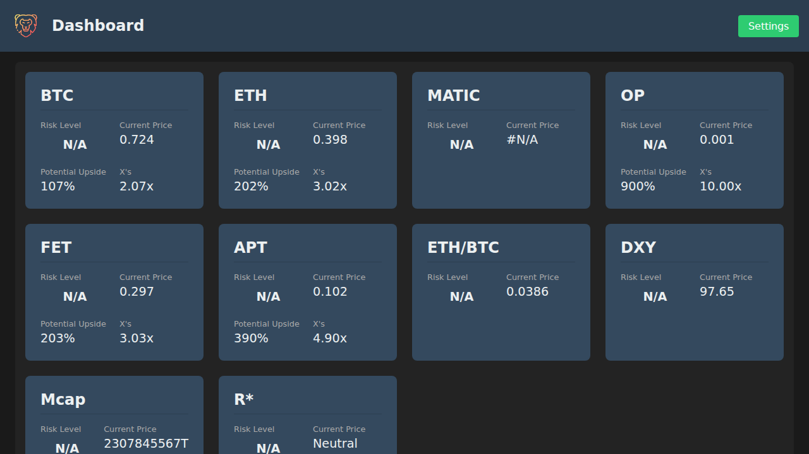

# Dynamic Asset Dashboard

This is a highly configurable, mobile-friendly Progressive Web App (PWA) for visualizing and analyzing financial asset data from a Google Sheet. It's designed to provide at-a-glance insights into your portfolio with a clean, card-based UI.



## Features

*   **Google Sheets Integration:** Use your own Google Sheet as the single source of truth for your portfolio data.
*   **Card-Based UI:** Each asset is displayed as a "story" card, showing all its relevant metrics in an organized way.
*   **Calculated Metrics:** The app automatically calculates and displays:
    *   **Risk Level:** A normalized value (0.000-0.999) showing the current price's position within your defined range.
    *   **Potential Upside:** The percentage increase from the current price to your defined potential high.
    *   **"X" Value:** The multiple of the potential high price relative to the current price.
*   **Per-Asset Configuration:** A detailed settings modal allows you to configure color-coded "risk level" thresholds for each individual asset.
*   **Mobile-First Design:** The application is fully responsive and optimized for a great user experience on mobile devices.
*   **PWA Ready:** The dashboard is an installable Progressive Web App, allowing you to add it to your home screen for easy access.
*   **Auto-Refresh:** The data from your Google Sheet is automatically refreshed every 5 minutes.

## How to Use

### 1. Set Up Your Google Sheet

Your Google Sheet should have 5 columns for each asset:

1.  **Ticker:** The asset's ticker symbol (e.g., `BTC`, `ETH`). This must match the symbol on CoinGecko if you were to use the live price feature in the future.
2.  **Current Price / Risk Metric:** The current price of the asset or the primary metric you want to track.
3.  **Data 1:** Any additional data point.
4.  **Data 2:** Any additional data point.
5.  **Potential High:** The potential high price for the asset, used to calculate the "Potential Upside" and "X's" values.

**Example:**
```
BTC,0.724,"115,820",1,1.5
ETH,0.398,"4,481",2,1.2
...
```

### 2. Publish Your Google Sheet as a CSV

To allow the app to fetch your data, you need to publish your sheet to the web:

1.  Open your Google Sheet.
2.  Go to **File > Share > Publish to web**.
3.  In the dialog box, under the **Link** tab, select the sheet you want to display.
4.  In the dropdown menu, choose **Comma-separated values (.csv)**.
5.  Click the **Publish** button.
6.  Copy the URL that Google provides.

### 3. Configure the Dashboard

1.  Open the dashboard application.
2.  Click the **Settings** button in the top right corner.
3.  Paste the **CSV URL** you copied from Google Sheets into the "Portfolio Google Sheet CSV URL" field and click **Save URL**.
4.  The dashboard will now display the data from your sheet.

### 4. Configure Per-Asset Thresholds

1.  Click the **Settings** button again.
2.  You will see a list of all the assets from your sheet. Click on the asset you want to configure.
3.  In the asset detail view, you can set the **Low Price Threshold** (the "sell" level, will be colored red) and the **High Price Threshold** (the "buy" level, will be colored green).
4.  Click **Save Thresholds**. The color of the "Risk Level" on the asset's card will now update based on where the current price falls within this range.

## How to Run Locally

This is a static web application. You can run it locally using any simple HTTP server. For example, if you have Python installed:

```bash
python -m http.server
```

Then, open your browser and go to `http://localhost:8000`.
